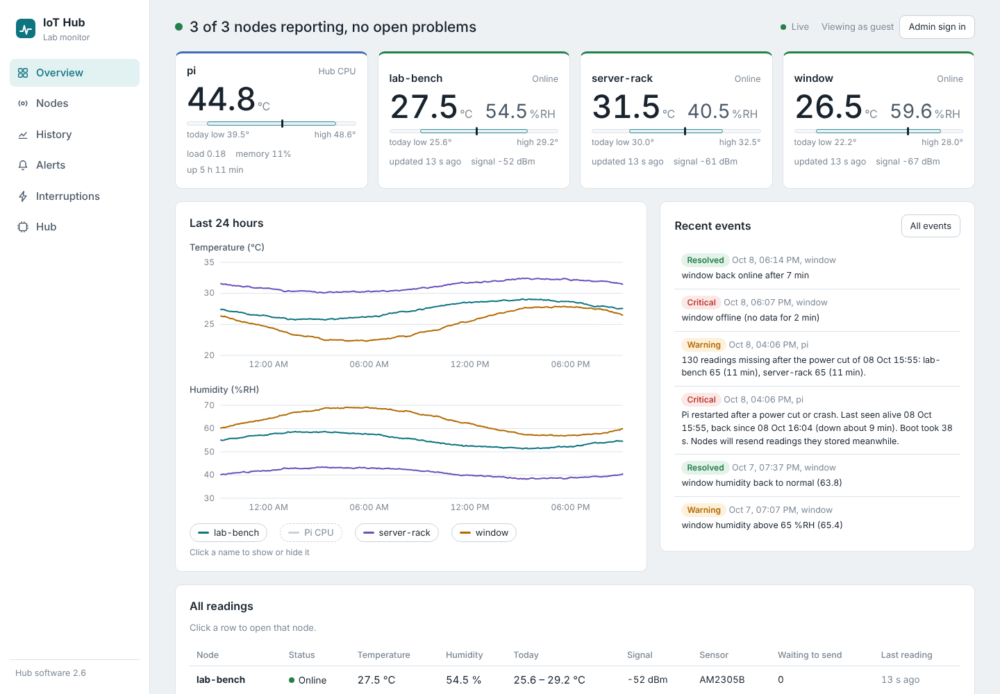
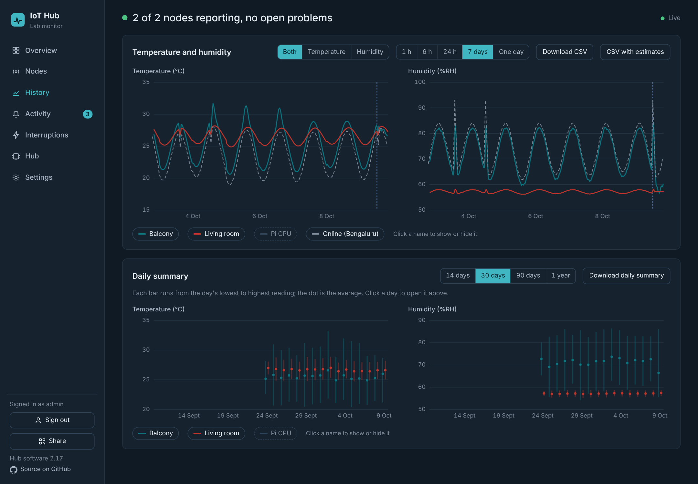
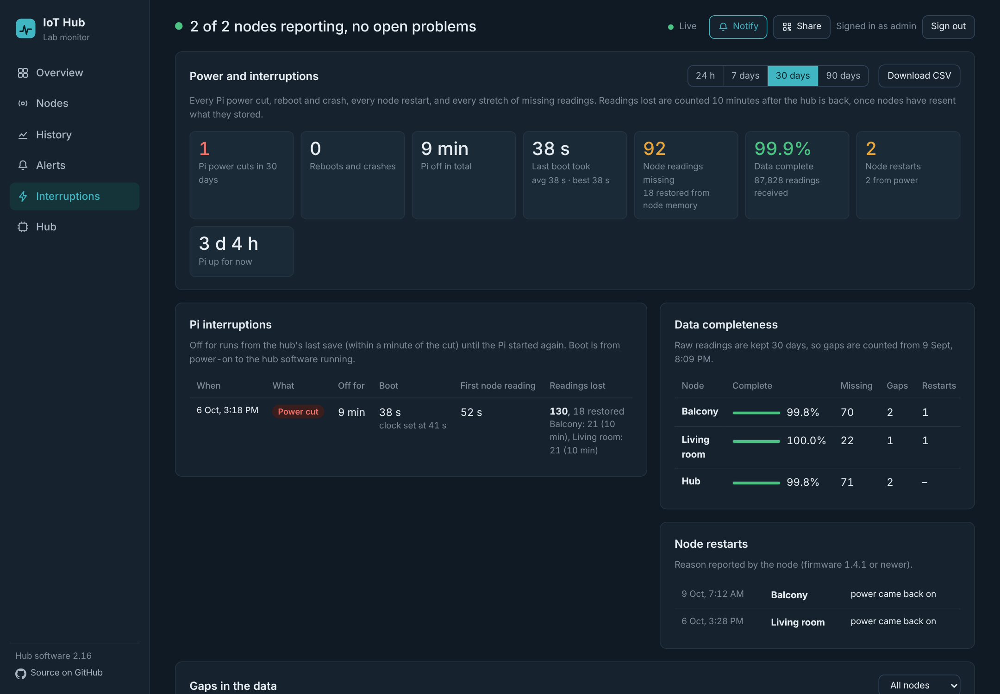
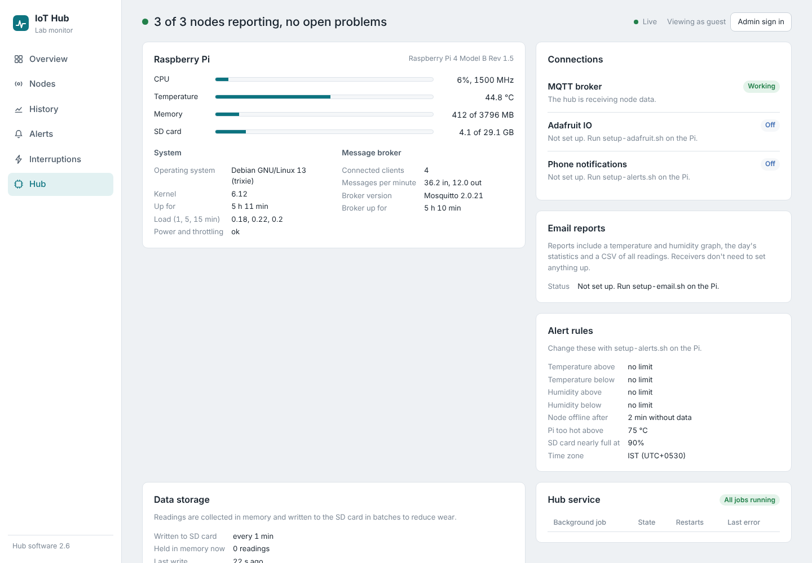
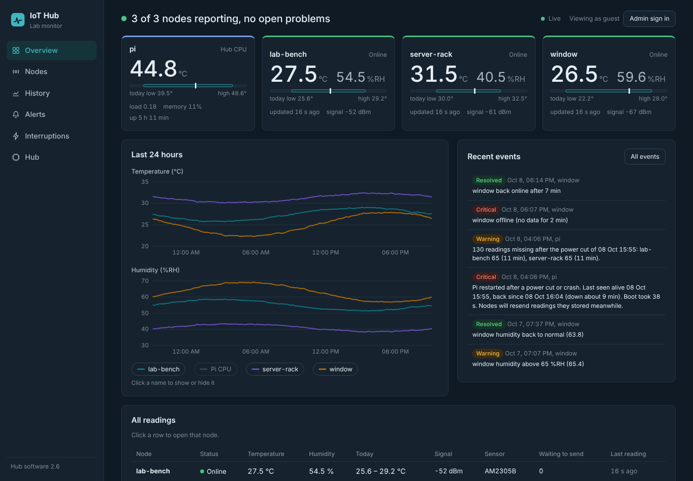
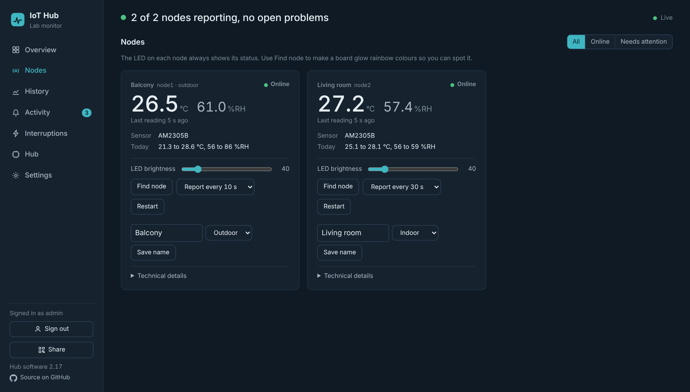
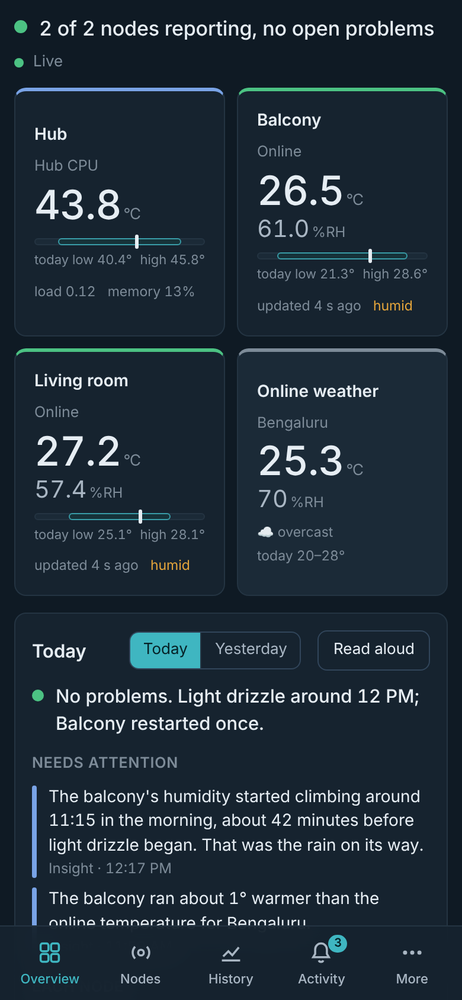
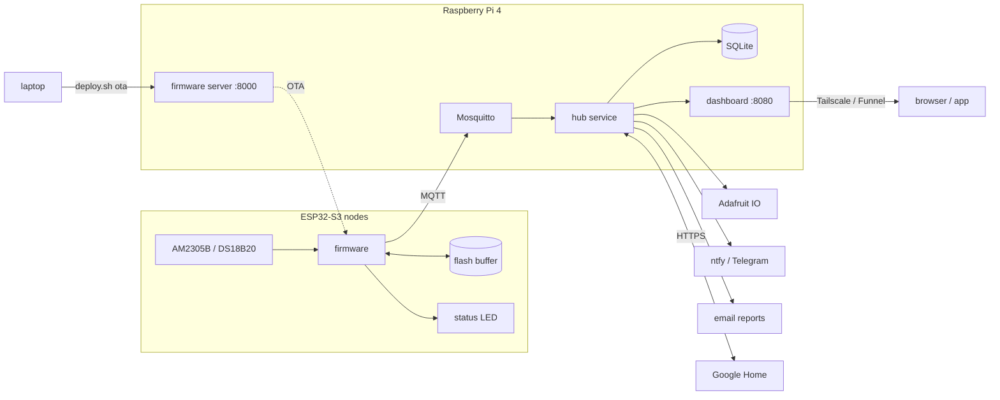
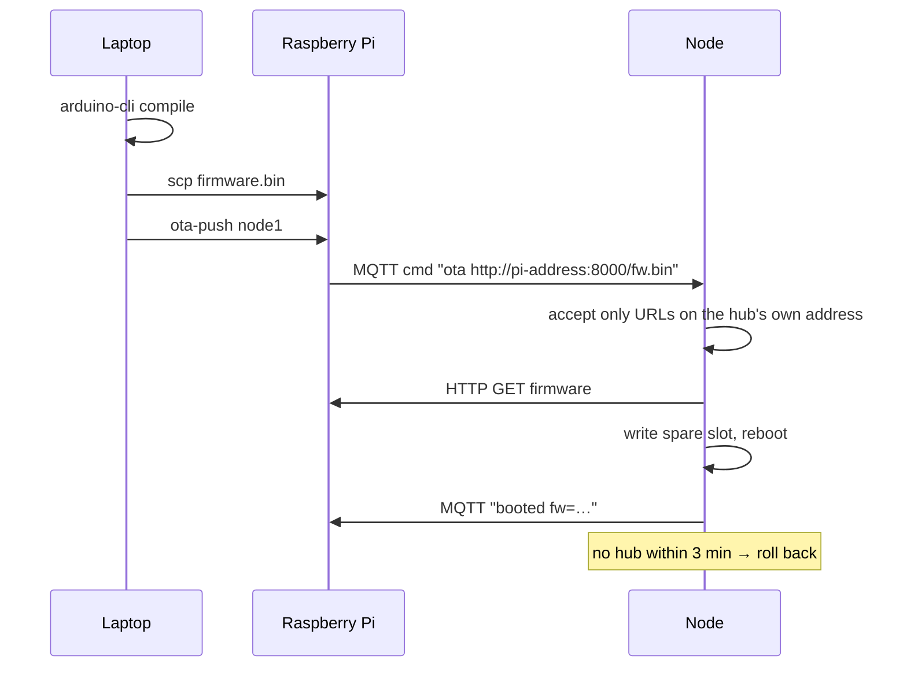

<div align="center">

# IoT_Pi32

**Temperature and humidity monitoring with ESP32-S3 sensor nodes and a Raspberry Pi hub.**
Live dashboard from anywhere, phone alerts, email reports, cloud upload and over-the-air updates,
built to keep every reading through Wi-Fi drops and power cuts.




</div>

---

## Contents

1. [Highlights](#1-highlights)
2. [Screenshots](#2-screenshots)
3. [How it works](#3-how-it-works)
   1. [Data flow](#31-data-flow)
   2. [Power cuts and gaps](#32-power-cuts-and-gaps)
   3. [Firmware updates](#33-firmware-updates)
4. [Hardware](#4-hardware)
   1. [Parts](#41-parts)
   2. [Wiring](#42-wiring)
5. [Getting started](#5-getting-started)
   1. [Prepare the Pi](#51-prepare-the-pi)
   2. [Install the hub](#52-install-the-hub)
   3. [Optional extras](#53-optional-extras)
   4. [Flash the first node](#54-flash-the-first-node)
6. [Everyday use](#6-everyday-use)
   1. [Update firmware over Wi-Fi](#61-update-firmware-over-wi-fi)
   2. [Common commands](#62-common-commands)
   3. [Status LED](#63-status-led)
   4. [Install the dashboard as an app](#64-install-the-dashboard-as-an-app)
7. [Troubleshooting](#7-troubleshooting)
8. [Project layout](#8-project-layout)

**Full reference** – every command, setting, MQTT topic and API endpoint: [docs/REFERENCE.md](docs/REFERENCE.md)

---

## 1. Highlights

| | |
| --- | --- |
| **No lost readings** | Nodes store up to 8000 readings in flash while the hub is away, then send them back. After every reconnect they also resend their last ~6 minutes, so readings that seemed sent just before a power cut aren't lost. The hub keeps only the ones it doesn't have. |
| **Dashboard anywhere** | Live readings, any-day history, daily min/avg/max, alerts, interruptions and hub health. Shared publicly over HTTPS with Tailscale Funnel, guest view by default, admin sign-in for controls. Installs as an app on phones and desktops. |
| **Knows what went wrong** | Every Pi power cut, reboot and crash is recorded with downtime, boot time and the readings lost per node. Node restarts include the reason (power on, brownout, crash, update). Every gap in the data gets a likely cause. |
| **Day summary** | A short, friendly briefing: problems first, then the outdoor weather, each node's highs, comparisons with yesterday and the week, comfort, and one or two things worth knowing. Sent to the phone every evening, on the dashboard with Read aloud, and at the top of the email report. |
| **Weather insights** | Local weather from Open-Meteo (free) explains what the sensors see: a humidity rise just before rain, rooms warmer than outside, tomorrow's forecast. Phone alerts when rain looks likely soon, plus tips for damp air, heat and when to open a window. Outdoor temperature is drawn on every chart. |
| **Rain predictor** | Mark a node as outdoor (say, "Balcony") and it becomes a little weather station. The hub learns what the graph looks like before rain (humidity climbing, cooling, air near saturation), weighs it against the online weather, and gives the chance of rain in the next two hours with the reasons. When it isn't sure whether it rained, it asks you: buttons in the phone notification or on the dashboard. It retrains on your answers and keeps score against the plain forecast. |
| **Friendly names** | Call a node "Balcony" or "Bedroom" and set it indoor or outdoor, from its card on the dashboard or with `iothub name`. The ID and history stay the same; summaries, charts and Google Home use the name. |
| **Alerts and reports** | Push notifications with ntfy (free, no account) and/or Telegram. Email reports with charts to any address, daily or on demand. |
| **Google Home** | Every node is a sensor in Google Home ("what's the temperature of node 1"), its LED a light ("turn off node 1 light"), plus "find" and "restart" scenes, today's high and low, and the hub. No Matter hub needed. |
| **Updates over Wi-Fi** | `./deploy.sh ota node1` builds on the laptop, hands the image to the Pi and the node pulls it from there. If the new firmware can't reach the hub it rolls back by itself. |
| **Kind to the SD card** | Readings are batched in RAM and written once a minute, logs live in RAM, raw data is kept 30 days, daily summaries forever. |
| **Works without a router** | Plug an Ethernet cable into the Pi and it becomes the access point for the nodes. Nodes find the hub on their own: gateway, mDNS, then last known address. |
| **Readable LED** | Each node's RGB LED shows its state with smooth animations, plus a rainbow "find me" mode. |

## 2. Screenshots

<table>
<tr>
<td width="50%"><br><sub><b>History</b> – any range or day, temperature and humidity side by side, daily min/avg/max. Small gaps are drawn as dashed estimates.</sub></td>
<td width="50%"><br><sub><b>Interruptions</b> – power cuts, boot times, readings lost and restored, data completeness per node, node restarts.</sub></td>
</tr>
<tr>
<td><br><sub><b>Hub</b> – Pi health, connections, email reports, alert rules, storage, background jobs.</sub></td>
<td><br><sub><b>Dark mode</b> – follows the system setting.</sub></td>
</tr>
<tr>
<td><br><sub><b>Nodes</b> – readings first, technical details folded away; admins get brightness, find, interval and restart.</sub></td>
<td align="center"><br><sub><b>Phone</b> – bottom tab bar, installable as an app.</sub></td>
</tr>
</table>

<sub>Screenshots use demo data.</sub>

## 3. How it works

### 3.1 Data flow



Each node publishes temperature and humidity every 10 s (adjustable). The hub holds readings in
memory and writes them to SQLite in one transaction a minute. A daily min/avg/max table is updated
with each write and kept forever; raw readings are kept for 30 days.

### 3.2 Power cuts and gaps

- **Hub unreachable:** the node writes readings to a ring buffer in flash, dated by NTP or the hub's
  clock, and sends them in batches when the hub is back. The charts fill in.
- **Sudden Pi power cut:** the node's connection still looks open for a while, and the hub loses
  whatever it hadn't written yet. Every node therefore resends its last few minutes after each
  reconnect, and the hub drops duplicates.
- **Counting what's left:** ten minutes after start-up the hub records what is still missing per node
  on the Interruptions page. Gaps up to 15 minutes are drawn as dashed estimates, never stored as
  readings.
- **No clock battery:** the Pi doesn't know the time until NTP answers. Readings taken before that
  are dated once the clock is confirmed, and nodes only get the hub's time after that.

### 3.3 Firmware updates

Updates never come from the internet directly:



## 4. Hardware

### 4.1 Parts

| Part | Notes |
| --- | --- |
| Raspberry Pi 4 | Raspberry Pi OS Lite 64-bit, a proper 5.1 V 3 A supply, preferably a high-endurance SD card |
| ESP32-S3 dev board | tested on ESP32-S3-DevKitM-1; onboard RGB LED on GPIO 48 |
| AM2305B sensor | temperature and humidity; or a DS18B20 for temperature only |
| 4.7 kΩ resistor | pull-up for the sensor data line |

### 4.2 Wiring

| Sensor | ESP32-S3 |
| --- | --- |
| VDD (red) | 3V3 |
| GND (black) | GND |
| DATA (yellow) | GPIO 1, plus 4.7 kΩ to 3V3 |

Avoid GPIO 0, which is the BOOT strapping pin. Give each node its own USB supply so it keeps
recording when the Pi loses power.

## 5. Getting started

### 5.1 Prepare the Pi

Flash Raspberry Pi OS Lite with SSH enabled, then:

```bash
sudo apt update && sudo apt install -y mosquitto mosquitto-clients
sudo mosquitto_passwd -c /etc/mosquitto/passwd esp
printf 'listener 1883\nallow_anonymous false\npassword_file /etc/mosquitto/passwd\n' \
  | sudo tee /etc/mosquitto/conf.d/iothub.conf
sudo systemctl restart mosquitto
```

For access from anywhere, install [Tailscale](https://tailscale.com):

```bash
curl -fsSL https://tailscale.com/install.sh | sh
sudo tailscale up --ssh
sudo tailscale funnel --bg 8080      # optional: public HTTPS link to the dashboard
```

### 5.2 Install the hub

From your laptop (replace `<pi>` with the Pi's SSH host):

```bash
scp -r pi <pi>:~/iothub-ota
ssh -t <pi> bash iothub-ota/setup-ota.sh          # MQTT login, firmware server, ota-push
ssh -t <pi> bash iothub-ota/setup-dashboard.sh    # hub service, dashboard, iothub command
```

The dashboard is now at `http://<pi>:8080`.

### 5.3 Optional extras

| Script | Adds |
| --- | --- |
| `setup-alerts.sh` | ntfy / Telegram notifications and temperature / humidity limits |
| `setup-email.sh` | email reports (sent from a Gmail account with an app password) |
| `setup-adafruit.sh` | upload to Adafruit IO (free plan limits respected) |
| `setup-weather.sh` | local weather, rain alerts, tips and the evening summary time |
| `setup-speaker.sh` | optional: also speak the summary on a Google speaker (off unless `SPEAKER_ENABLED=yes`) |
| `setup-google.sh` | Google Home: nodes appear as sensors, readable by voice (needs the Funnel link) |
| `setup-network.sh` | Ethernet mode: the Pi runs the `IoTHub` Wi-Fi for the nodes |
| `protect-sd.sh` | fewer SD card writes, time zone (reboot after) |
| `optimize-boot.sh` | faster boot for a headless Pi (reboot after) |

Run them on the Pi with `bash ~/iothub-ota/<script>`. When you copy an updated `pi` folder later,
`scp` places it at `~/iothub-ota/pi/`, so run the scripts from there.

### 5.4 Flash the first node

On the laptop, with [arduino-cli](https://arduino.github.io/arduino-cli/) installed and your user
allowed to use serial ports:

```bash
./deploy.sh setup                                   # ESP32 core and libraries, once
cp iot_node/secrets.example.h iot_node/secrets.h    # Wi-Fi, MQTT password, LED pin
./deploy.sh usb                                     # build, flash over USB, open the monitor
```

If the board doesn't show up, hold **BOOT** while plugging it in, and use the port labelled USB.
Then name it:

```bash
ssh <pi> iothub rename esp-a1b2c3 node1
```

All settings in `secrets.h` are listed in the [reference](docs/REFERENCE.md#3-node-settings).

## 6. Everyday use

### 6.1 Update firmware over Wi-Fi

```bash
./deploy.sh ota node1      # or: ./deploy.sh ota all
```

It ends with `booted fw=<version>`. `./deploy.sh usb` always works as a fallback.

### 6.2 Common commands

Run on the Pi, or from anywhere with `ssh <pi> iothub …`:

| Command | |
| --- | --- |
| `iothub status` | services, links, nodes online, open problems |
| `iothub nodes` | every node: readings, sensor, firmware, signal |
| `iothub watch [node]` | live MQTT stream |
| `iothub interruptions` | power cuts, boot times, readings lost |
| `iothub find <node>` | rainbow LED for 10 s |
| `iothub report` | email a report now |

The full list, with node control, data export, backups and resets, is in the
[command reference](docs/REFERENCE.md#2-pi-the-iothub-command).

### 6.3 Status LED

| LED | State |
| --- | --- |
| 🟢 green, slow breathing, white flash per reading | online and healthy |
| 🔵 blue pulse | looking for Wi-Fi |
| 🟠 amber heartbeat | hub unreachable, storing readings |
| 🩵 cyan shimmer | sending stored readings |
| 🔴 red heartbeat | sensor not reading |
| 🟣 purple | firmware update |
| 🌈 rainbow | "find node" |

### 6.4 Install the dashboard as an app

Open the HTTPS (Funnel) link. In Chrome, Edge or Android use **Install app**; on iPhone use
Safari → Share → **Add to Home Screen**.

To let someone else open it, click **Share** at the top of the dashboard: it shows a QR code for the
public link, ready to scan with a phone camera.

## 7. Troubleshooting

| Symptom | Fix |
| --- | --- |
| `No board found` | hold BOOT while plugging in; use the USB (not UART) port; try a data-capable cable |
| USB error `-71` on Linux | same as above: BOOT while plugging in |
| LED amber heartbeat | node has Wi-Fi but no hub: check `iothub status` and the MQTT password |
| LED red heartbeat | sensor wiring or pull-up; data must be on `SENSOR_PIN` |
| Node never joins `IoTHub` | set `AP_PASS` in `secrets.h` to the password used in `setup-network.sh` |
| `ota-push` says node not online | the node must be connected to the Pi's broker; check `iothub nodes` |
| Can't install the dashboard as an app | use the HTTPS Funnel link, not the plain `http://` address |
| Gaps after a power cut | normal if the node lost power too; give nodes their own supply |
| Under-voltage warnings | use a 5.1 V 3 A supply for the Pi |

## 8. Project layout

```
iot_node/
  iot_node.ino            node firmware
  secrets.example.h       settings template (copy to secrets.h)
deploy.sh                 laptop: setup, build, usb, ota, monitor
pi/
  setup-*.sh              one-time setup scripts (see Getting started)
  protect-sd.sh           SD card protection
  optimize-boot.sh        faster boot
  ota-push                push firmware to nodes
  iothub                  management command
  dashboard/
    iothub.py             hub service: MQTT, storage, alerts, reports, uploads, web API
    static/               dashboard web app, manifest, service worker, icons
docs/
  REFERENCE.md            commands, settings, MQTT topics, HTTP API
  images/                 screenshots
```
