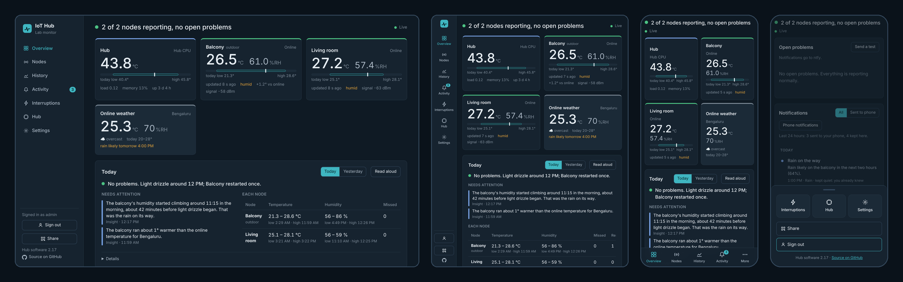
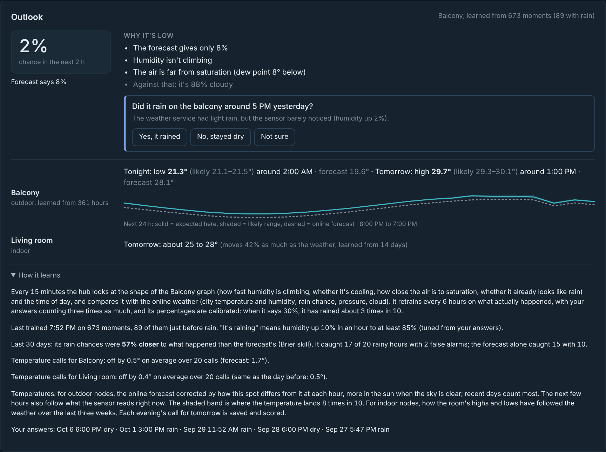
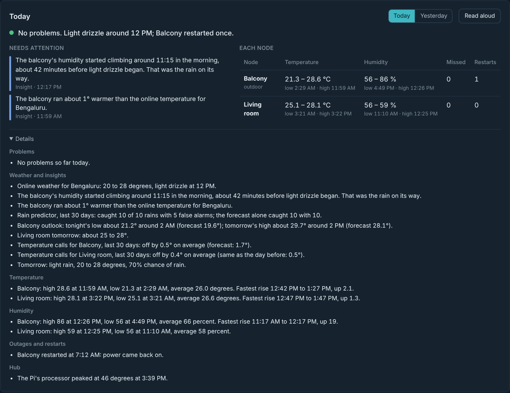
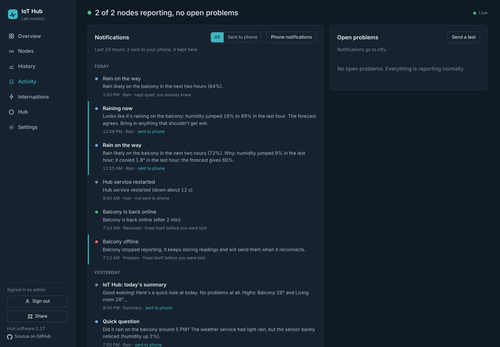
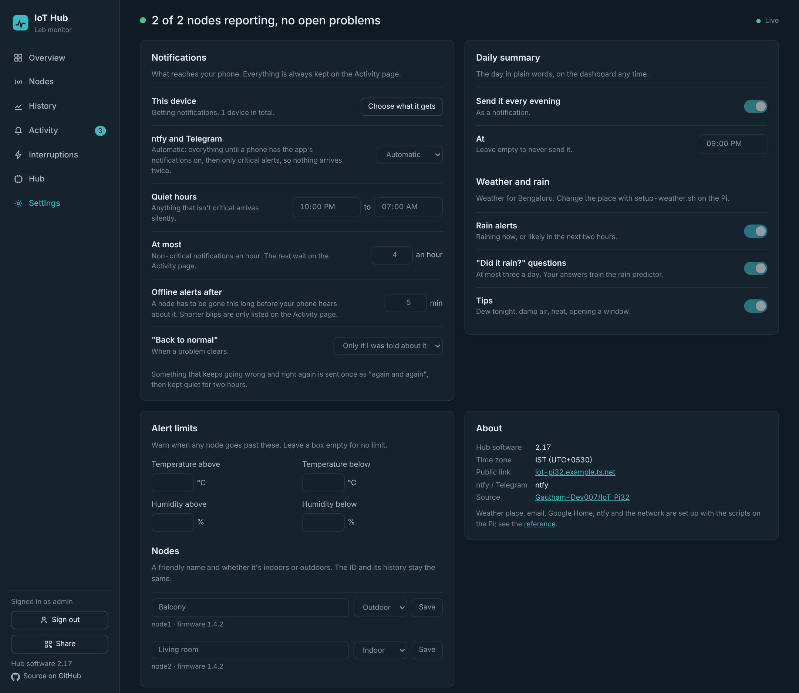
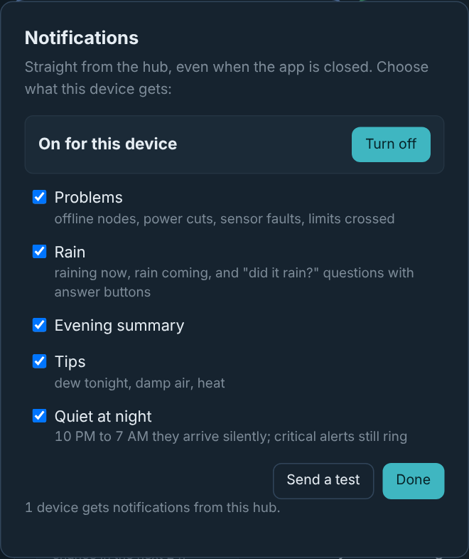
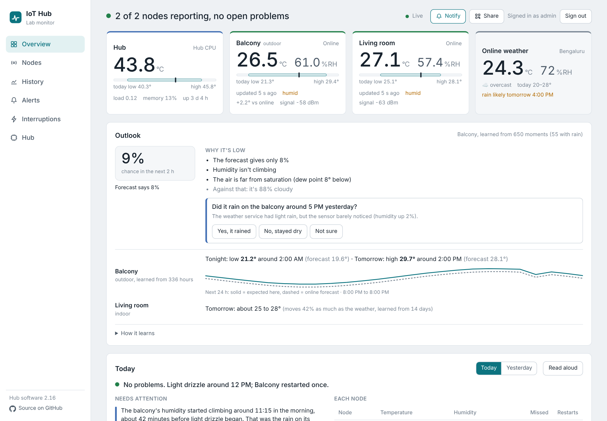
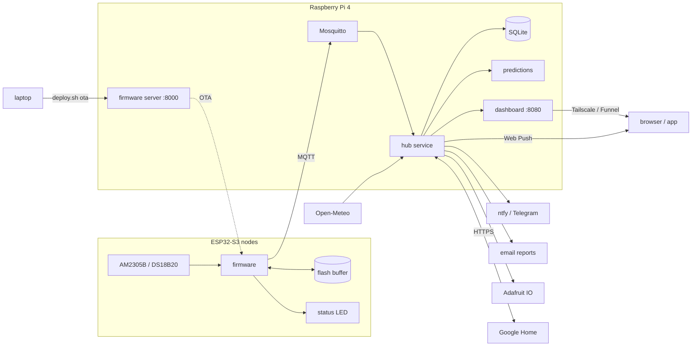
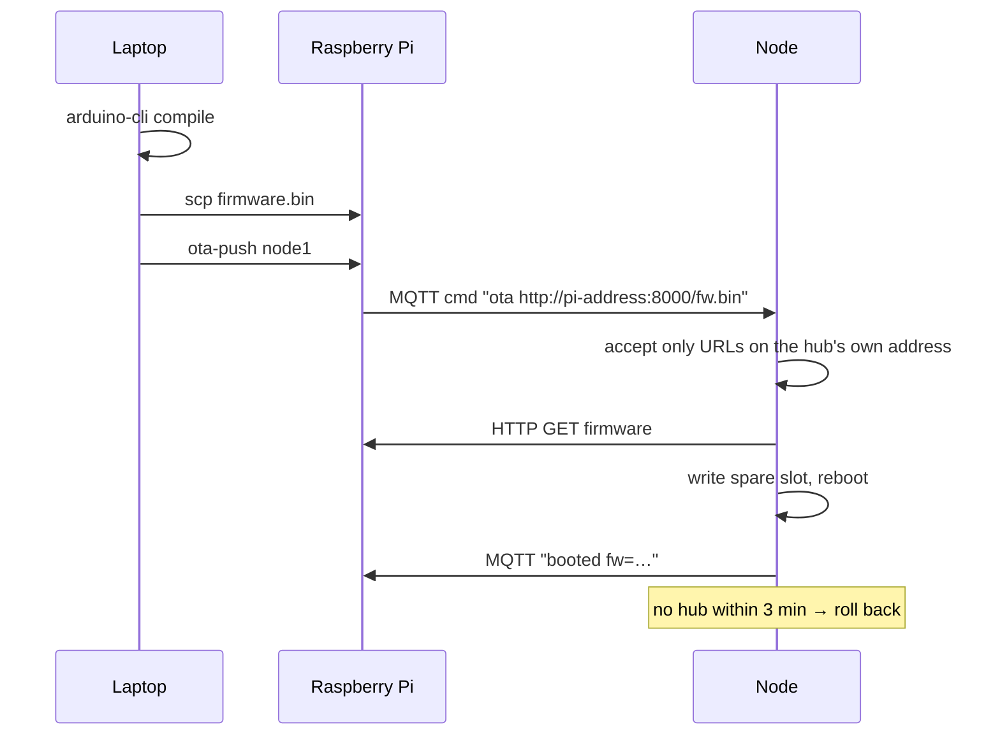

<div align="center">

# IoT_Pi32

**Temperature and humidity monitoring with ESP32-S3 sensor nodes and a Raspberry Pi hub
that learns its surroundings.**
Live dashboard from anywhere, day summaries in plain words, rain and temperature predictions that
learn from your own sensors, notifications straight to the installed app, Google Home, email
reports and over-the-air updates. Built to keep every reading through Wi-Fi drops and power cuts.


</div>

---

## Contents

1. [Highlights](#1-highlights)
   1. [Never lose a reading](#11-never-lose-a-reading)
   2. [Understands what it measures](#12-understands-what-it-measures)
   3. [Tells you, the way you like](#13-tells-you-the-way-you-like)
2. [Screenshots](#2-screenshots)
3. [How it works](#3-how-it-works)
   1. [Data flow](#31-data-flow)
   2. [Power cuts and gaps](#32-power-cuts-and-gaps)
   3. [How the predictions learn](#33-how-the-predictions-learn)
   4. [Firmware updates](#34-firmware-updates)
4. [Hardware](#4-hardware)
   1. [Parts](#41-parts)
   2. [Wiring](#42-wiring)
5. [Getting started](#5-getting-started)
   1. [Prepare the Pi](#51-prepare-the-pi)
   2. [Install the hub](#52-install-the-hub)
   3. [Optional extras](#53-optional-extras)
   4. [Flash the first node](#54-flash-the-first-node)
6. [Everyday use](#6-everyday-use)
   1. [Name your nodes](#61-name-your-nodes)
   2. [Turn on notifications](#62-turn-on-notifications)
   3. [Answer "did it rain?"](#63-answer-did-it-rain)
   4. [Update firmware over Wi-Fi](#64-update-firmware-over-wi-fi)
   5. [Common commands](#65-common-commands)
   6. [Status LED](#66-status-led)
   7. [Install the dashboard as an app](#67-install-the-dashboard-as-an-app)
7. [Troubleshooting](#7-troubleshooting)
8. [Project layout](#8-project-layout)

**Full reference** – every command, setting, MQTT topic and API endpoint: [docs/REFERENCE.md](docs/REFERENCE.md)

---

## 1. Highlights

### 1.1 Never lose a reading

| | |
| --- | --- |
| **No lost readings** | Nodes store up to 8000 readings in flash while the hub is away, then send them back. After every reconnect they also resend their last ~6 minutes, so readings that seemed sent just before a power cut aren't lost. The hub keeps only the ones it doesn't have. |
| **Knows what went wrong** | Every Pi power cut, reboot and crash is recorded with downtime, boot time and the readings lost per node. Node restarts include the reason (power on, brownout, crash, update). Every gap in the data gets a likely cause. |
| **Kind to the SD card** | Readings are batched in RAM and written once a minute, logs live in RAM, raw data is kept 30 days, daily summaries forever. The hub forecasts when the card would fill up. |
| **Works without a router** | Plug an Ethernet cable into the Pi and it becomes the access point for the nodes. Nodes find the hub on their own: gateway, mDNS, then last known address. |
| **Updates over Wi-Fi** | `./deploy.sh ota node1` builds on the laptop, hands the image to the Pi and the node pulls it from there. If the new firmware can't reach the hub it rolls back by itself. |

### 1.2 Understands what it measures

| | |
| --- | --- |
| **Friendly names, indoor or outdoor** | Call a node "Balcony" or "Living room" and mark it indoor or outdoor. The ID and history stay the same; summaries, charts, notifications and Google Home use the name, and the advice fits the place. |
| **Day summary** | A short, friendly briefing: problems first, then highs and lows with times, how it compares with yesterday and the week, the weather, and one or two things worth knowing ("the balcony's humidity started climbing 40 minutes before the drizzle began"). On the dashboard with Read aloud, on the phone every evening, and in the email report. |
| **Weather that explains the readings** | Local weather from [Open-Meteo](https://open-meteo.com) (free, no account) is drawn on every chart and cross-checked with the sensors: rain arriving, the sun on an outdoor sensor, a room warmer than outside, damp air, heat. |
| **Rain predictor** | An outdoor node becomes a little weather station. The hub learns what its graph looks like before rain (humidity climbing, cooling, air near saturation), weighs that against the online forecast, and gives the chance of rain in the next two hours with the reasons, including why it's low. |
| **Asks when it isn't sure** | "Did it rain on the balcony around 5 PM?" When the forecast and the sensor disagree, it asks, on the dashboard or with Yes / No buttons in the notification. It retrains on your answers and keeps score against the plain forecast. |
| **Outlook** | Tonight's low and tomorrow's high for each node. Outdoor nodes: the forecast corrected by how that spot differs from it at each hour, sunny or cloudy. Indoor nodes: how the room follows the weather. Dew warnings, and every call scored against what really happened. |

### 1.3 Tells you, the way you like

| | |
| --- | --- |
| **Made for every screen** | Phones get bottom tabs and a "More" sheet, tablets and split-screen windows a slim icon menu, laptops the full menu. Each panel adapts to the space it actually has, buttons grow for fingers, dialogs become bottom sheets, and it respects notches and the system's dark or light mode. |
| **Dashboard anywhere** | Live readings, any-day history, daily min/avg/max, the outlook, alerts, interruptions and hub health. Public over HTTPS with Tailscale Funnel, guest view by default, admin sign-in for controls, a QR code to share it. Dark and light mode. Installs as an app on phones and desktops. |
| **Notifications that don't nag** | Every message is listed on the Activity page; only what's worth interrupting you for reaches the phone. A node must be gone for a few minutes before "offline" is sent, quick blips stay in the inbox, nothing is repeated within its cool-down (even across restarts), something that keeps flipping is sent once as "again and again", and there's an hourly limit and quiet hours. |
| **App notifications** | Straight from the hub to the installed app (Web Push), no extra app or account. Each device picks problems, rain, the evening summary and tips; critical alerts always ring. With the app on a phone, ntfy only sends critical alerts, so nothing arrives twice. |
| **Settings in the app** | Notification rules, quiet hours, the summary time, rain questions and tips, alert limits and node names, all on the Settings page. No SSH needed for everyday changes. |
| **ntfy, Telegram and email** | Push alerts with ntfy (free, no account) and/or Telegram, with the same answer buttons. Email reports with charts to any address, daily or on demand. |
| **Google Home** | Every node is a sensor ("what's the temperature on the balcony"), its LED a light, plus "find" and "restart" scenes, today's high and low, a spoken day summary and the hub itself. No Matter hub needed. |
| **Readable LED** | Each node's RGB LED shows its state with smooth animations, plus a rainbow "find me" mode. |

## 2. Screenshots

<p align="center"></p>
<p align="center"><sub>One web app for every screen: bottom tabs on phones, a slim menu in split-screen and on tablets, the full menu on laptops. Panels rearrange to the space they get.</sub></p>

<table>
<tr>
<td colspan="2"><br><sub><b>Outlook</b> – the chance of rain in the next two hours and why, a question it wants you to answer, tonight's low and tomorrow's high learned for each spot (solid) against the online forecast (dashed).</sub></td>
</tr>
<tr>
<td colspan="2"><br><sub><b>Day summary</b> – headline first, then insights, each node's highs and lows with times, and the details: weather, rain predictor record, temperature calls and their accuracy, outages and restarts.</sub></td>
</tr>
<tr>
<td width="50%"><br><sub><b>History</b> – any range or day, temperature and humidity side by side with the online weather, daily min/avg/max. Small gaps are drawn as dashed estimates.</sub></td>
<td width="50%"><br><sub><b>Interruptions</b> – power cuts, boot times, readings lost and restored, data completeness per node, node restarts with the reason.</sub></td>
</tr>
<tr>
<td><br><sub><b>Nodes</b> – readings first, technical details folded away; admins get brightness, find, interval, restart, and the name and place.</sub></td>
<td><br><sub><b>Hub</b> – Pi health, connections (MQTT, Adafruit IO, Google Home, ntfy, app notifications), email reports, alert rules, storage, background jobs.</sub></td>
</tr>
<tr>
<td width="50%"><br><sub><b>Activity</b> – everything the hub had to say, by day; what was sent to the phone and why the rest was kept quiet; open problems alongside.</sub></td>
<td width="50%"><br><sub><b>Settings</b> – notification rules, summary, rain and tips, alert limits, node names.</sub></td>
</tr>
<tr>
<td align="center"><br><sub><b>Notifications</b> – per device: what it gets, and quiet hours.</sub></td>
<td align="center"><br><sub><b>Phone</b> – bottom tab bar, installable as an app.</sub></td>
</tr>
<tr>
<td colspan="2"><br><sub><b>Light mode</b> – follows the system setting, like dark mode.</sub></td>
</tr>
</table>

<sub>The Balcony readings are real (9 October 2026, Bengaluru: 1:45 to 7:45 PM, every 10 s). The earlier
history, the living room and the power cut were filled in to show the features that need a few weeks of data.</sub>

## 3. How it works

### 3.1 Data flow



Each node publishes temperature and humidity every 10 s (adjustable). The hub holds readings in
memory and writes them to SQLite in one transaction a minute. A daily min/avg/max table is updated
with each write and kept forever; raw readings are kept for 30 days. Hourly weather is fetched every
15 minutes and stored next to the readings, so the past can be compared with what the forecast said.

### 3.2 Power cuts and gaps

- **Hub unreachable:** the node writes readings to a ring buffer in flash, dated by NTP or the hub's
  clock, and sends them in batches when the hub is back. The charts fill in.
- **Sudden Pi power cut:** the node's connection still looks open for a while, and the hub loses
  whatever it hadn't written yet. Every node therefore resends its last few minutes after each
  reconnect, and the hub drops duplicates.
- **Counting what's left:** ten minutes after start-up the hub records what is still missing per node
  on the Interruptions page. Gaps up to 15 minutes are drawn as dashed estimates, never stored as
  readings.
- **No clock battery:** the Pi doesn't know the time until NTP answers. Readings taken before that
  are dated once the clock is confirmed, and nodes only get the hub's time after that.

### 3.3 How the predictions learn

Everything runs on the Pi; nothing is sent to an AI service.

| Prediction | Looks at | Learns from |
| --- | --- | --- |
| **Rain in the next 2 h** (outdoor nodes) | humidity level and how fast it's rising (1 h, 3 h), cooling, distance from saturation, whether it already looks like rain, time of day, sensor vs city readings, forecast rain chance, pressure change, cloud | a logistic regression retrained every 6 h on 60 days (exact fit, a fraction of a second on the Pi): what happened after each moment, and your answers (worth three times as much). Starts from a sensible built-in guess; the percentages are calibrated, so 30% means rain about 3 times in 10. |
| **"It's raining now"** | humidity jump in the last hour and its peak | your yes/no answers move the thresholds |
| **Tonight's low, tomorrow's high, next 24 h** (outdoor) | the hourly forecast and cloud cover, and what the sensor reads right now | how this spot differs from the forecast at each hour, growing with how clear the sky is (sun on the sensor), over 21 days with recent days counting most; the next few hours also follow the current reading. Comes with a likely range that holds 8 times in 10 |
| **Tomorrow's range** (indoor) | the outdoor forecast | how the room's daily high and low followed the weather (3 weeks) |
| **Dew overnight** | the spot's expected humidity | as above |
| **SD card full** | daily used space | the trend over up to 60 days |

Every evening's temperature call and every rain prediction is saved and scored against what really
happened, next to the plain forecast, so you can see whether it's earning its keep.

On a 70-day simulated balcony with a forecast that's biased, misses a quarter of the rain and gives false
alarms (scored day by day, each day using only what the hub knew beforehand):

| | Hub | Forecast alone |
| --- | --- | --- |
| Rain in the next 2 h, Brier score (lower is better) | **0.028** | 0.063 |
| Rainy half-hours caught at 50% / false alarms | **62 of 79 / 19** | 38 of 79 / 26 |
| Tonight's low, average error | **0.56°** | 1.43° |
| Tomorrow's high (with afternoon sun), average error | **1.10°** | 3.60° |
| Next 6 hours, average error | **0.52°** | 1.22° | Details in the
[reference](docs/REFERENCE.md#8-predictions).

### 3.4 Firmware updates

Updates never come from the internet directly:



## 4. Hardware

### 4.1 Parts

| Part | Notes |
| --- | --- |
| Raspberry Pi 4 | Raspberry Pi OS Lite 64-bit, a proper 5.1 V 3 A supply, preferably a high-endurance SD card |
| ESP32-S3 dev board | tested on ESP32-S3-DevKitM-1; onboard RGB LED on GPIO 48 |
| AM2305B sensor | temperature and humidity; or a DS18B20 for temperature only |
| 4.7 kΩ resistor | pull-up for the sensor data line |

### 4.2 Wiring

| Sensor | ESP32-S3 |
| --- | --- |
| VDD (red) | 3V3 |
| GND (black) | GND |
| DATA (yellow) | GPIO 1, plus 4.7 kΩ to 3V3 |

Avoid GPIO 0, which is the BOOT strapping pin. Give each node its own USB supply so it keeps
recording when the Pi loses power. For an outdoor node, keep the sensor out of direct rain; some sun
is fine, since the hub learns when the sun is on it.

## 5. Getting started

### 5.1 Prepare the Pi

Flash Raspberry Pi OS Lite with SSH enabled, then:

```bash
sudo apt update && sudo apt install -y mosquitto mosquitto-clients
sudo mosquitto_passwd -c /etc/mosquitto/passwd esp
printf 'listener 1883\nallow_anonymous false\npassword_file /etc/mosquitto/passwd\n' \
  | sudo tee /etc/mosquitto/conf.d/iothub.conf
sudo systemctl restart mosquitto
```

For access from anywhere, install [Tailscale](https://tailscale.com):

```bash
curl -fsSL https://tailscale.com/install.sh | sh
sudo tailscale up --ssh
sudo tailscale funnel --bg 8080      # public HTTPS link: needed for the app, notifications and Google Home
```

### 5.2 Install the hub

From your laptop (replace `<pi>` with the Pi's SSH host):

```bash
scp -r pi <pi>:~/iothub-ota
ssh -t <pi> bash iothub-ota/setup-ota.sh          # MQTT login, firmware server, ota-push
ssh -t <pi> bash iothub-ota/setup-dashboard.sh    # hub service, dashboard, iothub command
```

The dashboard is now at `http://<pi>:8080`, and at the Funnel link if you turned it on.

### 5.3 Optional extras

| Script | Adds |
| --- | --- |
| `setup-weather.sh` | local weather: rain alerts, tips, the outlook and the evening summary time. **Recommended**: most of the smart features need it |
| `setup-alerts.sh` | ntfy / Telegram notifications and temperature / humidity limits |
| `setup-email.sh` | email reports (sent from a Gmail account with an app password) |
| `setup-google.sh` | Google Home: nodes appear as sensors, readable by voice (needs the Funnel link) |
| `setup-adafruit.sh` | upload to Adafruit IO (free plan limits respected) |
| `setup-speaker.sh` | optional: also speak the summary on a Google speaker (off unless `SPEAKER_ENABLED=yes`) |
| `setup-network.sh` | Ethernet mode: the Pi runs the `IoTHub` Wi-Fi for the nodes |
| `protect-sd.sh` | fewer SD card writes, time zone (reboot after) |
| `optimize-boot.sh` | faster boot for a headless Pi (reboot after) |

Run them on the Pi with `bash ~/iothub-ota/<script>`. When you copy an updated `pi` folder later,
`scp` places it at `~/iothub-ota/pi/`, so run the scripts from there.

### 5.4 Flash the first node

On the laptop, with [arduino-cli](https://arduino.github.io/arduino-cli/) installed and your user
allowed to use serial ports:

```bash
./deploy.sh setup                                   # ESP32 core and libraries, once
cp iot_node/secrets.example.h iot_node/secrets.h    # Wi-Fi, MQTT password, LED pin
./deploy.sh usb                                     # build, flash over USB, open the monitor
```

If the board doesn't show up, hold **BOOT** while plugging it in, and use the port labelled USB.
Then give it an ID, and a friendly name and place:

```bash
ssh <pi> iothub rename esp-a1b2c3 node1
ssh <pi> iothub name node1 Balcony outdoor
```

All settings in `secrets.h` are listed in the [reference](docs/REFERENCE.md#3-node-settings).

## 6. Everyday use

### 6.1 Name your nodes

On the **Nodes** page, type a name and choose Indoor or Outdoor, or run `iothub name node1 Balcony outdoor`.
Outdoor nodes get rain predictions, sun and dew detection and comparisons with the forecast; indoor
nodes get ventilation, damp and heat tips. After renaming, say "Hey Google, sync my devices".

### 6.2 Turn on notifications

Open the HTTPS link on the phone or laptop, sign in as admin, open **Activity** → **Phone notifications** → **Turn on**. Choose
what that device gets: problems, rain (including questions with answer buttons), the evening summary,
tips, and whether to stay quiet from 10 PM to 7 AM. Critical alerts always ring. On iPhone, add the
dashboard to the Home Screen first and turn notifications on from there.

**Activity** lists everything the hub said, including what it kept quiet and why; its badge counts open
problems, or unread notifications when there are none. How chatty it is
(quiet hours, an hourly limit, how long a node must be offline, "back to normal" messages, whether ntfy
also sends) is on the **Settings** page.

### 6.3 Answer "did it rain?"

When the forecast and an outdoor sensor disagree, the hub asks whether it rained. Tap **Yes** or
**No** in the notification, on the Outlook card, or run `iothub rain yes`. Your answers retrain the
rain predictor; "How it learns" on the Outlook card shows its record next to the forecast's.

### 6.4 Update firmware over Wi-Fi

```bash
./deploy.sh ota node1      # or: ./deploy.sh ota all
```

It ends with `booted fw=<version>`. `./deploy.sh usb` always works as a fallback.

### 6.5 Common commands

Run on the Pi, or from anywhere with `ssh <pi> iothub …`:

| Command | |
| --- | --- |
| `iothub status` | services, links, nodes online, open problems |
| `iothub nodes` | every node: readings, sensor, firmware, signal |
| `iothub summary [yesterday]` | the day in plain words |
| `iothub outlook` | tonight's low, tomorrow's high, dew, SD card |
| `iothub rain` | chance of rain in the next 2 h, why, and questions waiting |
| `iothub weather` | outside now and current tips |
| `iothub name <node> <Name> [indoor\|outdoor]` | friendly name and place |
| `iothub interruptions` | power cuts, boot times, readings lost |
| `iothub find <node>` | rainbow LED for 10 s |
| `iothub report` | email a report now |

The full list, with node control, data export, backups and resets, is in the
[command reference](docs/REFERENCE.md#2-pi-the-iothub-command).

### 6.6 Status LED

| LED | State |
| --- | --- |
| 🟢 green, slow breathing, white flash per reading | online and healthy |
| 🔵 blue pulse | looking for Wi-Fi |
| 🟠 amber heartbeat | hub unreachable, storing readings |
| 🩵 cyan shimmer | sending stored readings |
| 🔴 red heartbeat | sensor not reading |
| 🟣 purple | firmware update |
| 🌈 rainbow | "find node" |

### 6.7 Install the dashboard as an app

Open the HTTPS (Funnel) link. In Chrome, Edge or Android use **Install app**; on iPhone use
Safari → Share → **Add to Home Screen**.

To let someone else open it, click **Share** at the top of the dashboard: it shows a QR code for the
public link, ready to scan with a phone camera. Visitors see a read-only guest view.

## 7. Troubleshooting

| Symptom | Fix |
| --- | --- |
| `No board found` | hold BOOT while plugging in; use the USB (not UART) port; try a data-capable cable |
| USB error `-71` on Linux | same as above: BOOT while plugging in |
| LED amber heartbeat | node has Wi-Fi but no hub: check `iothub status` and the MQTT password |
| LED red heartbeat | sensor wiring or pull-up; data must be on `SENSOR_PIN` |
| Node never joins `IoTHub` | set `AP_PASS` in `secrets.h` to the password used in `setup-network.sh` |
| `ota-push` says node not online | the node must be connected to the Pi's broker; check `iothub nodes` |
| Can't install the app or turn on notifications | use the HTTPS Funnel link, not the plain `http://` address; on iPhone add it to the Home Screen first |
| Too many notifications | Settings → lower "At most … an hour", raise "Offline alerts after", set "Back to normal" to Never; if ntfy and the app both ring, set ntfy to Automatic |
| Notifications dialog says the hub needs a package | `sudo apt install python3-cryptography`, then `iothub restart` |
| No Outlook card | needs `setup-weather.sh` and about a day of readings; rain predictions need a node marked outdoor |
| Gaps after a power cut | normal if the node lost power too; give nodes their own supply |
| Under-voltage warnings | use a 5.1 V 3 A supply for the Pi |

## 8. Project layout

```
iot_node/
  iot_node.ino            node firmware
  secrets.example.h       settings template (copy to secrets.h)
deploy.sh                 laptop: setup, build, usb, ota, monitor
pi/
  setup-*.sh              one-time setup scripts (see Getting started)
  protect-sd.sh           SD card protection
  optimize-boot.sh        faster boot
  ota-push                push firmware to nodes
  iothub                  management command
  dashboard/
    iothub.py             hub service: MQTT, storage, alerts, summaries, weather, predictions,
                          notifications, reports, uploads, Google Home, web API
    static/               dashboard web app, manifest, service worker, icons
docs/
  REFERENCE.md            commands, settings, MQTT topics, HTTP API, predictions, notifications
  images/                 screenshots
```
